# HL7 MLLP → Kafka → Azure Event Hubs → Microsoft Fabric

## Overview
This project demonstrates a healthcare data streaming pipeline:
- HL7 v2.x messages ingested via MLLP on AKS
- Streamed to Azure Event Hubs using Kafka protocol
- Routed into Microsoft Fabric Eventstream for real-time analytics

## Architecture

```mermaid
%%{init: {'theme': 'base', 'themeVariables': { 'fontSize': '24px' }}}%%
flowchart LR
   subgraph Client["🏥 On-Premises"]
      HL7["HL7 Source<br/>HIS/EMR"]
   end

   subgraph Azure["☁️ Azure Subscription"]
      subgraph VNet["VNet: 10.200.0.0/16"]
         subgraph AKS["AKS Cluster"]
               LB["Load Balancer<br/>Port 2575"]
               Pod1["HL7 Listener<br/>Pod 1"]
               Pod2["HL7 Listener<br/>Pod 2"]
         end
         subgraph PESubnet["PE Subnet: 10.200.4.0/24"]
               PE["🔒 Private Endpoint<br/>hl7-eventhub-pe"]
         end
      end
      
      subgraph EventHubs["Event Hubs Namespace"]
         EH["📨 hl7-events<br/>Kafka Protocol"]
      end
      
      LA["📊 Log Analytics"]
   end

   subgraph Fabric["📊 Microsoft Fabric"]
      MPE["🔒 Managed PE<br/>hl7-eventhub-mpe"]
      ES["⚡ Eventstream"]
      KQL["🗃️ Eventhouse<br/>KQL Database"]
      PBI["📈 Power BI"]
   end

   HL7 -->|"MLLP over TCP"| LB
   LB --> Pod1
   LB --> Pod2
   Pod1 -->|"Kafka Protocol"| PE
   Pod2 -->|"Kafka Protocol"| PE
   PE -->|"Private Link"| EH
   EH e1@-..->|"Diagnostics"| LA
   classDef animate stroke-dasharray: 9,5,stroke-dashoffset: 900,animation: dash 25s linear infinite;
   class e1 animate
   MPE -->|"Private Link"| EH
   ES --> MPE
   ES -->|"Streaming"| KQL
   KQL -->|"Query"| PBI

   linkStyle default stroke:#e8e8e8, stroke-width:2
   linkStyle 6 stroke-width:3px
   
   %% WCAG AA compliant colors with 4.5:1 contrast ratio
   style Client fill:#1a1a2e,stroke:#e94560,stroke-width:2px,color:#ffffff
   style Azure fill:#16213e,stroke:#0f3460,stroke-width:2px,color:#ffffff
   style VNet fill:#1f4068,stroke:#e8e8e8,stroke-width:2px,color:#ffffff
   style AKS fill:#2d4a6f,stroke:#ffd700,stroke-width:2px,color:#ffffff
   style PESubnet fill:#2d4a6f,stroke:#ffd700,stroke-width:1px,color:#ffffff
   style EventHubs fill:#4a1942,stroke:#e94560,stroke-width:2px,color:#ffffff
   style Fabric fill:#1e5128,stroke:#4e9f3d,stroke-width:2px,color:#ffffff
   style HL7 fill:#e94560,stroke:#ffffff,stroke-width:2px,color:#ffffff
   style LB fill:#0f3460,stroke:#ffd700,stroke-width:2px,color:#ffffff
   style Pod1 fill:#0f3460,stroke:#e8e8e8,stroke-width:1px,color:#ffffff
   style Pod2 fill:#0f3460,stroke:#e8e8e8,stroke-width:1px,color:#ffffff
   style PE fill:#d4a017,stroke:#1a1a2e,stroke-width:2px,color:#1a1a2e
   style EH fill:#7b2d8e,stroke:#ffffff,stroke-width:2px,color:#ffffff
   style LA fill:#0f3460,stroke:#e8e8e8,stroke-width:1px,color:#ffffff
   style MPE fill:#d4a017,stroke:#1a1a2e,stroke-width:2px,color:#1a1a2e
   style ES fill:#4e9f3d,stroke:#ffffff,stroke-width:2px,color:#ffffff
   style KQL fill:#1e5128,stroke:#4e9f3d,stroke-width:2px,color:#ffffff
   style PBI fill:#4e9f3d,stroke:#ffffff,stroke-width:2px,color:#ffffff
```



### Data Flow

| Step | Component | Description |
|------|-----------|-------------|
| 1 | **HL7 Source** | Sends MLLP messages to AKS Load Balancer on port 2575 |
| 2 | **HL7 Listener Pods** | Receive messages, parse HL7 v2.x, produce to Kafka |
| 3 | **Private Endpoint** | Routes traffic securely to Event Hubs (no public internet) |
| 4 | **Event Hubs** | Receives messages via Kafka protocol |
| 5 | **Fabric MPE** | Connects to Event Hubs via private link |
| 6 | **Eventstream** | Ingests and optionally transforms data in real-time |
| 7 | **Eventhouse (KQL)** | Stores data for analytics and querying |
| 8 | **Power BI** | Visualizes HL7 message trends and patient data |

## Deployed Resources
- **Azure Container Registry**: For storing the HL7 listener container image
- **Virtual Network**: 10.200.0.0/16 with AKS and Private Endpoint subnets
- **AKS Cluster**: Kubernetes 1.32, Standard_B2ps_v2 nodes (cost-optimized), autoscaling 1-3 nodes, pre-configured ACR pull access
- **Event Hubs Namespace**: Kafka-enabled with private endpoint (public access disabled)
- **Private DNS Zone**: For Event Hubs private connectivity
- **Log Analytics Workspace**: For diagnostic logging and monitoring
- **Microsoft Fabric Capacity**: F2 SKU

## Network Configuration
| Component | Address Space |
|-----------|---------------|
| VNet | 10.200.0.0/16 |
| AKS Subnet | 10.200.0.0/22 |
| Private Endpoint Subnet | 10.200.4.0/24 |
| Kubernetes Service CIDR | 10.201.0.0/16 |

## Prerequisites
- Azure subscription with the following providers registered:
  ```bash
  az provider register --namespace Microsoft.EventHub --wait
  az provider register --namespace Microsoft.Fabric --wait
  ```
- Azure CLI with Bicep installed
- SSH public key

## Quick Start

```bash
# 1. Validate prerequisites
make validate

# 2. Deploy infrastructure
make infra

# 3. Deploy HL7 listener
make deploy

# 4. Test (replace with your external IP)
make test IP=<EXTERNAL-IP>
```

Or use the scripts directly:
- **Linux/macOS**: `./deploy.sh`
- **Windows PowerShell**: `.\deploy.ps1`

## Deployment

### Using Parameters File (Recommended)
```bash
az deployment sub create \
  --template-file infra/main.bicep \
  --location centralus \
  --parameters infra/main.parameters.json
```

### Using Inline Parameters
```bash
az deployment sub create \
  --template-file infra/main.bicep \
  --location centralus \
  --parameters sshPublicKey="$(cat ~/.ssh/id_rsa.pub)"
```

### Custom Configuration
```bash
az deployment sub create \
  --template-file infra/main.bicep \
  --location centralus \
  --parameters sshPublicKey="$(cat ~/.ssh/id_rsa.pub)" \
               rgName='my-hl7-rg' \
               location='westus2' \
               deployFabricCapacity=false
```

### Parameters
| Parameter | Default | Description |
|-----------|---------|-------------|
| `location` | centralus | Azure region for resources |
| `rgName` | hl7-demo-rg | Resource group name |
| `aksName` | hl7-aks | AKS cluster name |
| `acrName` | hl7acr{unique} | Azure Container Registry name |
| `deployFabricCapacity` | true | Deploy Fabric capacity (requires quota) |
| `existingLogAnalyticsWorkspaceId` | *(empty)* | Resource ID of existing Log Analytics workspace (see below) |
| `sshPublicKey` | *required* | SSH public key for AKS nodes |

### Using an Existing Log Analytics Workspace

By default, a new Log Analytics workspace is created. To use an existing workspace:

1. Get the resource ID of your existing workspace:
   ```bash
   az monitor log-analytics workspace show \
     --resource-group <your-rg> \
     --workspace-name <your-workspace> \
     --query id -o tsv
   ```

2. Pass the resource ID during deployment:
   ```bash
   az deployment sub create \
     --template-file infra/main.bicep \
     --location centralus \
     --parameters sshPublicKey="$(cat ~/.ssh/id_rsa.pub)" \
                  existingLogAnalyticsWorkspaceId="/subscriptions/<sub-id>/resourceGroups/<rg>/providers/Microsoft.OperationalInsights/workspaces/<workspace-name>"
   ```

## Teardown

### Azure Resources
```bash
az group delete --name hl7-demo-rg --yes --no-wait
```

### Microsoft Fabric Resources
Fabric resources are managed separately and must be deleted manually:

1. **Delete Eventstream** (if created):
   - Go to your Fabric workspace → Right-click the Eventstream → **Delete**

2. **Delete Eventhouse/KQL Database**:
   - Right-click the Eventhouse → **Delete**

3. **Delete Managed Private Endpoints**:
   - Go to **Workspace settings** → **Network security**
   - Select each private endpoint → **Delete**

4. **Delete Workspace** (optional):
   - Go to **Workspace settings** → **General** → **Remove this workspace**

5. **Delete Fabric Capacity** (if no longer needed):
   ```bash
   az resource delete \
     --resource-group hl7-demo-rg \
     --name hl7fabriccap \
     --resource-type "Microsoft.Fabric/capacities"
   ```
   > **Note**: The Fabric capacity is billed hourly. Delete it when not in use to avoid charges.

## HL7 Listener Application

### Automated Deployment (Recommended)

After deploying infrastructure with Bicep, run the deployment script:

**Linux/macOS (bash):**
```bash
./deploy.sh
```

**Windows (PowerShell):**
```powershell
.\deploy.ps1
```

This script automatically:
1. Gets ACR and AKS details from the deployment
2. Builds and pushes the container image
3. Creates Kubernetes secrets with Event Hubs credentials
4. Deploys the HL7 listener to AKS
5. Exposes it via LoadBalancer

### Manual Deployment

If you prefer manual steps:

1. **Get AKS credentials**:
   ```bash
   az aks get-credentials --resource-group hl7-demo-rg --name hl7-aks
   ```

2. **Build and push image** (ACR is pre-configured with AKS pull access):
   ```bash
   ACR_NAME=$(az acr list --resource-group hl7-demo-rg --query "[0].name" -o tsv)
   az acr build --registry $ACR_NAME --image hl7listener:v1 ./src/hl7-listener/
   ```

3. **Get Event Hubs connection string**:
   ```bash
   EH_NAMESPACE=$(az eventhubs namespace list --resource-group hl7-demo-rg --query "[0].name" -o tsv)
   az eventhubs namespace authorization-rule keys list \
     --resource-group hl7-demo-rg \
     --namespace-name $EH_NAMESPACE \
     --name KafkaSendListen \
     --query primaryConnectionString -o tsv
   ```

4. **Deploy to Kubernetes**:
   ```bash
   kubectl apply -f k8s/namespace.yaml
   
   kubectl create secret generic eventhub-credentials \
     --namespace hl7 \
     --from-literal=EVENTHUB_NAMESPACE=<your-namespace> \
     --from-literal=EVENTHUB_CONNECTION_STRING="<your-connection-string>"
   
   # Update image in k8s/deployment.yaml, then:
   kubectl apply -f k8s/deployment.yaml
   kubectl apply -f k8s/service.yaml
   ```

5. **Get the external IP**:
   ```bash
   kubectl get service hl7-listener -n hl7
   ```

### Test the Listener

Send test HL7 messages:
```bash
python src/hl7-listener/send_test_hl7.py <EXTERNAL-IP> 2575
```

### Local Development

Run locally without Kafka:
```bash
cd src/hl7-listener
pip install -r requirements.txt
python hl7_listener.py
```

Test locally:
```bash
python send_test_hl7.py localhost 2575
```

## Microsoft Fabric Setup

After deploying the infrastructure and HL7 listener, configure Microsoft Fabric to ingest and analyze HL7 messages.

### Step 1: Create Fabric Workspace

1. Navigate to [Microsoft Fabric](https://app.fabric.microsoft.com)
2. Click **Workspaces** → **New workspace**
3. Name it `hl7-analytics` (or your preference)
4. Under **Advanced**, select your deployed Fabric capacity (`hl7fabriccap`)
5. Click **Apply**

### Step 2: Create Managed Private Endpoint (Required)

Event Hubs is configured with private endpoints only. Fabric supports Managed Private Endpoints for secure connectivity.

#### Part A: Create the Private Endpoint in Fabric

1. Open your Fabric workspace (`hl7-analytics`)
2. Click **Workspace settings** (top-right corner)
3. In the left menu, select **Network security**
4. Click **Create** to add a new private endpoint
5. Set the **Managed Private Endpoint Name** to "hl7-eventhub-mpe"
6. For **Resource identifier**, enter your Event Hubs resource ID:
   ```
   /subscriptions/<subscription-id>/resourceGroups/hl7-demo-rg/providers/Microsoft.EventHub/namespaces/<your-namespace>
   ```
   
   To get the resource ID, run:
   ```bash
   az eventhubs namespace show \
     --resource-group hl7-demo-rg \
     --name $(az eventhubs namespace list --resource-group hl7-demo-rg --query "[0].name" -o tsv) \
     --query id -o tsv
   ```

7. For **Target Sub-resource**, select **Azure Event Hub**
8. Click **Create**


#### Part B: Approve the Private Endpoint in Azure Portal

1. Open [Azure Portal](https://portal.azure.com)
2. Navigate to your **Event Hubs namespace** (e.g., `hl7ehnsh7kcjfwhqnvre`)
3. In the left menu, under **Settings**, click **Networking**
4. Click the **Private access** tab
5. Find the connection with **Connection...** status showing `Pending`
6. Select the checkbox next to it
7. Click **Approve** in the toolbar


8. In the "Approve connection" dialog, click **Yes**


#### Part C: Verify the Connection

1. Return to your Fabric workspace → **Workspace settings** → **Network security**
2. Confirm your endpoint status changed to **Approved**

> **Note**: It may take 1-2 minutes for the approval to propagate.

### Step 3: Create Eventhouse

1. In your Fabric workspace, click **+ New item** → **Eventhouse**
2. Name it `hl7-eventstream`
3. Click **Create**
4. A KQL database with the same name is automatically created

### Step 4: Configure Event Hubs Data Source

1. In the Eventhouse, click **Get data**
2. Select **Event Hubs** from the dropdown


3. Under **Select or create a destination table**, expand `hl7-eventstream`
4. Click **+ New table** and name it `hl7_messages`


5. On the right panel, select **Create new connection**
6. Fill in the connection details:

   | Field | Value |
   |-------|-------|
   | **Event Hub namespace** | Your namespace (e.g., `hl7ehnsh7kcjfwhqnvre`) |
   | **Event Hub** | `hl7-events` |
   | **Connection** | Create new connection |
   | **Connection name** | `hl7-eventhub-connection` |
   | **Data gateway** | `(none)` |
   | **Authentication kind** | Shared Access Key |
   | **Shared Access Key Name** | `KafkaSendListen` |
   | **Shared Access Key** | *(see below)* |

   To get the Shared Access Key:
   ```bash
   az eventhubs namespace authorization-rule keys list \
     --resource-group hl7-demo-rg \
     --namespace-name <your-namespace> \
     --name KafkaSendListen \
     --query primaryKey -o tsv
   ```


7. Click **Save**
8. Select a **Consumer group** (use `$Default`)
9. Click **Next** to proceed to schema inspection

### Step 5: Verify Data Flow

1. Send test HL7 messages:
   ```bash
   python src/hl7-listener/send_test_hl7.py <AKS-EXTERNAL-IP> 2575
   ```

2. In the Eventstream, verify messages are flowing (check the metrics on the canvas)

3. Query data in KQL Database:
   ```kusto
   hl7_messages
   | take 10
   ```

### Sample KQL Queries

Once data is flowing, use these queries for HL7 analytics:

```kusto
// Count messages by type
hl7_messages
| summarize count() by message_type
| render piechart

// Messages per hour
hl7_messages
| summarize count() by bin(timestamp, 1h)
| render timechart

// Recent ADT (Admit/Discharge/Transfer) messages
hl7_messages
| where message_type startswith "ADT"
| project timestamp, message_type, patient_id, sending_facility
| order by timestamp desc
| take 50

// Patient message history
hl7_messages
| where patient_id == "<PATIENT_ID>"
| project timestamp, message_type, sending_application
| order by timestamp desc
```

---

## Project Structure
```
hl7-eh-fab/
├── .github/workflows/     # CI/CD
│   └── deploy.yml         # GitHub Actions workflow
├── infra/                 # Infrastructure as Code (Bicep)
│   ├── main.bicep         # Subscription-level orchestrator (entry point)
│   ├── resources.bicep    # VNet, AKS, Event Hubs, Private Endpoints module
│   ├── fabricCapacity.bicep # Microsoft Fabric F2 capacity module
│   └── main.parameters.json # Default deployment parameters
├── k8s/                   # Kubernetes manifests
│   ├── namespace.yaml
│   ├── deployment.yaml
│   ├── service.yaml
│   └── secret.yaml
├── scripts/               # Utility scripts
│   └── validate-prereqs.sh # Prerequisites checker
├── src/hl7-listener/      # HL7 MLLP Listener application
│   ├── hl7_listener.py    # Main listener code
│   ├── send_test_hl7.py   # Test script
│   ├── Dockerfile
│   └── requirements.txt
├── deploy.sh              # Deployment script (bash)
├── deploy.ps1             # Deployment script (PowerShell)
├── Makefile               # Make commands for common tasks
├── TROUBLESHOOTING.md     # Common issues and solutions
├── prd hl7-eh-fab.md      # Product requirements document
├── LICENSE                # Apache 2.0 License
└── README.md              # This file
```

## Troubleshooting

See [TROUBLESHOOTING.md](TROUBLESHOOTING.md) for common issues and solutions.

## Monitoring & Diagnostics

The deployment includes a Log Analytics workspace with diagnostic settings for Event Hubs. This enables monitoring of:
- **OperationalLogs**: Namespace-level operations and errors
- **RuntimeAuditLogs**: Data plane operations (send/receive)
- **EventHubVNetConnectionEvent**: Private endpoint connection events

### Viewing Logs in Azure Portal

1. Navigate to your Log Analytics workspace (`hl7-logs-la`)
2. Click **Logs** in the left menu
3. Run queries against `AzureDiagnostics`

### Sample Log Analytics Queries

**Recent Event Hubs operations:**
```kusto
AzureDiagnostics
| where ResourceProvider == "MICROSOFT.EVENTHUB"
| where TimeGenerated > ago(1h)
| project TimeGenerated, Category, OperationName, Resource
| order by TimeGenerated desc
| take 50
```

**VNet/Private Endpoint connection events:**
```kusto
AzureDiagnostics
| where Category == "EventHubVNetConnectionEvent"
| project TimeGenerated, action_s, addressIp_s, message_s
| order by TimeGenerated desc
```

**Validate Private Endpoint is being used:**
```kusto
AzureDiagnostics
| where ResourceProvider == "MICROSOFT.EVENTHUB"
| where TimeGenerated > ago(1h)
| where isnotempty(clientIp_s)
| summarize count() by clientIp_s
| order by count_ desc
```
> If `clientIp_s` shows private IPs (e.g., `10.x.x.x`), traffic is flowing through the private endpoint.

**Event Hub throughput metrics:**
```kusto
AzureMetrics
| where ResourceProvider == "MICROSOFT.EVENTHUB"
| where MetricName in ("IncomingMessages", "OutgoingMessages", "IncomingBytes", "OutgoingBytes")
| summarize avg(Average) by bin(TimeGenerated, 5m), MetricName
| render timechart
```

### Querying from CLI

```bash
# Get workspace ID
LA_WORKSPACE_ID=$(az monitor log-analytics workspace show \
  --resource-group hl7-demo-rg \
  --workspace-name hl7-logs-la \
  --query customerId -o tsv)

# Run a query
az monitor log-analytics query \
  --workspace $LA_WORKSPACE_ID \
  --analytics-query "AzureDiagnostics | where ResourceProvider == 'MICROSOFT.EVENTHUB' | take 10" \
  -o table
```

## License
Apache License 2.0