# Reference Documentation

This document provides detailed technical reference for the HL7 MLLP → Azure Event Hubs → Microsoft Fabric pipeline.

## Table of Contents
- [Architecture Details](#architecture-details)
- [Deployed Resources](#deployed-resources)
- [Network Configuration](#network-configuration)
- [Deployment Parameters](#deployment-parameters)
- [Using an Existing Log Analytics Workspace](#using-an-existing-log-analytics-workspace)
- [Manual Deployment Steps](#manual-deployment-steps)
- [Microsoft Fabric Setup](#microsoft-fabric-setup)
- [Sample KQL Queries](#sample-kql-queries)
- [Monitoring & Diagnostics](#monitoring--diagnostics)
- [Security Considerations](#security-considerations)
- [Project Structure](#project-structure)

---

## Architecture Details

```mermaid
flowchart LR
   subgraph Client["🏥 On-Premises"]
      HL7["HL7 Source<br/>HIS/EMR"]
   end

   subgraph Azure["☁️ Azure"]
      subgraph VNet["VNet: 10.200.0.0/16"]
         subgraph AKS["AKS Cluster"]
               LB["Load Balancer<br/>Port 2575"]
               Pod1["HL7 Listener<br/>Pod 1"]
               Pod2["HL7 Listener<br/>Pod 2"]
         end
         subgraph PESubnet["PE Subnet"]
               PE["🔒 Private Endpoint<br/>hl7-eventhub-pe"]
         end
      end
      
      subgraph EventHubs["Event Hubs"]
         EH["📨 hl7-events<br/>Kafka Protocol"]
      end
      
      LA["📊 Log Analytics"]
   end

   subgraph Fabric["📊 Microsoft Fabric"]
      MPE["🔒 Managed PE<br/>hl7-eventhub-mpe"]
      KQL["🗃️ Eventhouse<br/>KQL Database"]
      PBI["📈 Power BI"]
   end

   HL7 -->|"MLLP over TCP"| LB
   LB --> Pod1
   LB --> Pod2
   Pod1 -->|"Kafka Protocol"| PE
   Pod2 -->|"Kafka Protocol"| PE
   PE -->|"Private Link"| EH
   EH -.->|"Diagnostics"| LA
   MPE -->|"Private Link"| EH
   KQL --> MPE
   KQL -->|"Query"| PBI
```

<details>
<summary>View Mermaid Diagram</summary>



</details>

### Data Flow

| Step | Component | Description |
|------|-----------|-------------|
| 1 | **HL7 Source** | Sends MLLP messages to AKS Load Balancer on port 2575 |
| 2 | **HL7 Listener Pods** | Receive messages, parse HL7 v2.x, produce to Kafka |
| 3 | **Private Endpoint** | Routes traffic securely to Event Hubs (no public internet) |
| 4 | **Event Hubs** | Receives messages via Kafka protocol |
| 5 | **Eventstream + Fabric MPE** | Eventstream connects to Event Hubs via managed private endpoint and normalizes events |
| 6 | **Eventhouse (KQL)** | Eventstream routes curated data into Eventhouse for analytics |
| 7 | **Power BI** | Visualizes HL7 message trends and patient data |

> **Why Eventstream?** Eventstream provides a Fabric-managed virtual network, simplifying managed private endpoint creation, and offers schema normalization before persisting data into Eventhouse. Learn more in the [Fabric Eventstream managed private endpoint documentation](https://learn.microsoft.com/en-us/fabric/real-time-intelligence/event-streams/set-up-private-endpoint).

---

## Deployed Resources

| Resource | Description |
|----------|-------------|
| **Azure Container Registry** | Stores the HL7 listener container image |
| **Virtual Network** | 10.200.0.0/16 with AKS and Private Endpoint subnets |
| **AKS Cluster** | Kubernetes 1.32, Standard_B2ps_v2 nodes, autoscaling 1-3 nodes |
| **Event Hubs Namespace** | Kafka-enabled with private endpoint (public access disabled) |
| **Private DNS Zone** | For Event Hubs private connectivity |
| **Log Analytics Workspace** | For diagnostic logging and monitoring |
| **Microsoft Fabric Capacity** | F2 SKU |

---

## Network Configuration

| Component | Address Space |
|-----------|---------------|
| VNet | 10.200.0.0/16 |
| AKS Subnet | 10.200.0.0/22 |
| Private Endpoint Subnet | 10.200.4.0/24 |
| Kubernetes Service CIDR | 10.201.0.0/16 |

---

## Deployment Parameters

| Parameter | Default | Description |
|-----------|---------|-------------|
| `location` | centralus | Azure region for resources |
| `rgName` | hl7-demo-rg | Resource group name |
| `aksName` | hl7-aks | AKS cluster name |
| `acrName` | hl7acr{unique} | Azure Container Registry name |
| `deployFabricCapacity` | true | Deploy Fabric capacity (requires quota) |
| `fabricAdminEmail` | *(required if deploying Fabric)* | Email for Fabric capacity administrator |
| `existingLogAnalyticsWorkspaceId` | *(empty)* | Resource ID of existing Log Analytics workspace |
| `sshPublicKey` | *required* | SSH public key for AKS nodes |

### Using Inline Parameters

```bash
az deployment sub create \
  --template-file infra/main.bicep \
  --location centralus \
  --parameters sshPublicKey="$(cat ~/.ssh/id_rsa.pub)"
```

### Custom Configuration

```bash
az deployment sub create \
  --template-file infra/main.bicep \
  --location centralus \
  --parameters sshPublicKey="$(cat ~/.ssh/id_rsa.pub)" \
               rgName='my-hl7-rg' \
               location='westus2' \
               deployFabricCapacity=false
```

---

## Using an Existing Log Analytics Workspace

By default, a new Log Analytics workspace is created. To use an existing workspace:

1. Get the resource ID of your existing workspace:
   ```bash
   az monitor log-analytics workspace show \
     --resource-group <your-rg> \
     --workspace-name <your-workspace> \
     --query id -o tsv
   ```

2. Pass the resource ID during deployment:
   ```bash
   az deployment sub create \
     --template-file infra/main.bicep \
     --location centralus \
     --parameters sshPublicKey="$(cat ~/.ssh/id_rsa.pub)" \
                  existingLogAnalyticsWorkspaceId="/subscriptions/<sub-id>/resourceGroups/<rg>/providers/Microsoft.OperationalInsights/workspaces/<workspace-name>"
   ```

---

## Manual Deployment Steps

If you prefer manual steps over the automated `deploy.sh`:

### 1. Get AKS credentials

```bash
az aks get-credentials --resource-group hl7-demo-rg --name hl7-aks
```

### 2. Build and push image

```bash
ACR_NAME=$(az acr list --resource-group hl7-demo-rg --query "[0].name" -o tsv)
az acr build --registry $ACR_NAME --image hl7listener:v1 --platform linux/arm64 ./src/hl7-listener/
```

### 3. Get Event Hubs connection string

```bash
EH_NAMESPACE=$(az eventhubs namespace list --resource-group hl7-demo-rg --query "[0].name" -o tsv)
az eventhubs namespace authorization-rule keys list \
  --resource-group hl7-demo-rg \
  --namespace-name $EH_NAMESPACE \
  --name KafkaSendListen \
  --query primaryConnectionString -o tsv
```

### 4. Deploy to Kubernetes

```bash
kubectl apply -f k8s/namespace.yaml

kubectl create secret generic eventhub-credentials \
  --namespace hl7 \
  --from-literal=EVENTHUB_NAMESPACE=<your-namespace> \
  --from-literal=EVENTHUB_CONNECTION_STRING="<your-connection-string>"
```

Update the image in `k8s/deployment.yaml`, then:
```bash
kubectl apply -f k8s/deployment.yaml
kubectl apply -f k8s/service.yaml
```

### 5. Get the external IP

```bash
kubectl get service hl7-listener -n hl7
```

---

## Microsoft Fabric Setup

After deploying the infrastructure and HL7 listener, configure Microsoft Fabric to ingest and analyze HL7 messages.

### Recommended workflow (Eventstream + Eventhouse)

1. **Create a Fabric workspace** (for example `hl7-analytics`) that targets the deployed Fabric capacity. Fabric workspace basics: [Create workspaces in Fabric](https://learn.microsoft.com/en-us/fabric/get-started/workspaces-manage).
2. **Create a managed private endpoint** under workspace **Network security** pointing at the Event Hubs namespace resource ID. Follow the [managed private endpoint overview](https://learn.microsoft.com/en-us/fabric/security/security-managed-private-endpoints-overview) for detailed instructions.
3. **Approve the managed private endpoint** in the Azure portal (Event Hubs → Networking → Private endpoint connections). Azure reference: [Event Hubs networking guide](https://learn.microsoft.com/en-us/azure/event-hubs/event-hubs-private-link).
4. **Create an Eventstream item** (`hl7-eventstream`) and add Azure Event Hubs as a source using the `FabricListen` shared access key. See [Connect Azure Event Hubs to Eventstream](https://learn.microsoft.com/en-us/fabric/real-time-intelligence/event-streams/connect-azure-event-hubs).
5. **Create an Eventhouse** (`hl7-eventhouse`) and route the Eventstream output into a table such as `hl7_messages`. Reference: [Create and use Eventhouse in Fabric](https://learn.microsoft.com/en-us/fabric/real-time-intelligence/eventhouse/create-eventhouse).
6. **Send test HL7 traffic** with `make test IP=<external-ip>` and query the Eventhouse (`hl7_messages | take 10`).
7. **Validate private connectivity** at any time with `make check-fabric RESOURCE_GROUP=<rg>` to ensure the managed private endpoint remains approved and Event Hubs is receiving messages.

See the README for a step-by-step screenshot walkthrough of these tasks.

<details>
<summary>Legacy direct Eventhouse connector (deprecated but retained for reference)</summary>

### Step 1: Create Fabric Workspace

1. Navigate to [Microsoft Fabric](https://app.fabric.microsoft.com)
2. Click **Workspaces** → **New workspace**
3. Name it `hl7-analytics` (or your preference)
4. Under **Advanced**, select your deployed Fabric capacity (`hl7fabriccap`)
5. Click **Apply**

### Step 2: Create Managed Private Endpoint (Required)

Event Hubs is configured with private endpoints only. Fabric supports Managed Private Endpoints for secure connectivity.

#### Part A: Create the Private Endpoint in Fabric

1. Open your Fabric workspace (`hl7-analytics`)
2. Click **Workspace settings** (gear icon, top-right corner)
3. In the left menu, select **Outbound networking**
4. Under **Managed private endpoints**, click **+ Create**
5. Set the **Managed private endpoint name** to `hl7-eventhub-mpe`
6. For **Resource identifier**, enter your Event Hubs resource ID:
   ```
   /subscriptions/<subscription-id>/resourceGroups/hl7-demo-rg/providers/Microsoft.EventHub/namespaces/<your-namespace>
   ```
   
   To get the resource ID, run:
   ```bash
   az eventhubs namespace show \
     --resource-group hl7-demo-rg \
     --name $(az eventhubs namespace list --resource-group hl7-demo-rg --query "[0].name" -o tsv) \
     --query id -o tsv
   ```

7. For **Target sub-resource**, select `namespace`
8. Click **Create**
9. The newly created connection will show `Provisioning`


#### Part B: Approve the Private Endpoint in Azure Portal

1. Open [Azure Portal](https://portal.azure.com)
2. Navigate to your **Event Hubs namespace** (e.g., `hl7ehnsh7kcjfwhqnvre`)
3. In the left menu, under **Settings**, click **Networking**
4. Click the **Private access** tab
5. Find the connection with **Connection...** status showing `Pending`
6. Select the checkbox next to it
7. Click **Approve** in the toolbar


8. In the "Approve connection" dialog, you can enter an optional comment, and then click **Yes**

#### Part C: Verify the Connection

1. Return to your Fabric workspace → **Workspace settings** → **Outbound networking**
2. Confirm your endpoint status changed to `Approved`

> **Note**: It may take 1-2 minutes for the approval to propagate.

### Step 3: Create Eventhouse

1. In your Fabric workspace, click **+ New item** → **Eventhouse**
2. Name it `hl7-eventhouse`
3. Click **Create**
4. A KQL database with the same name is automatically created

### Step 4: Configure Event Hubs Data Source

1. In the Eventhouse, click **Get data**
2. Select **Event Hubs** from the dropdown


3. Under **Select or create a destination table**, expand `hl7-eventhouse`
4. Click **+ New table** and name it `hl7_messages`


5. On the right panel, select **Create new connection**
6. Fill in the connection details:

   | Field | Value |
   |-------|-------|
   | **Event Hub namespace** | Your namespace (e.g., `hl7ehnsh7kcjfwhqnvre`) |
   | **Event Hub** | `hl7-events` |
   | **Connection** | Create new connection |
   | **Connection name** | `hl7-eventhub-connection` |
   | **Data gateway** | `(none)` |
   | **Authentication kind** | Shared Access Key |
   | **Shared Access Key Name** | `FabricListen` |
   | **Shared Access Key** | *(see below)* |

   To get the Shared Access Key (Event Hub level):
   ```bash
   EH_NAMESPACE=$(az eventhubs namespace list --resource-group hl7-demo-rg --query "[0].name" -o tsv)
   az eventhubs eventhub authorization-rule keys list \
     --resource-group hl7-demo-rg \
     --namespace-name $EH_NAMESPACE \
     --eventhub-name hl7-events \
     --name FabricListen \
     --query primaryKey -o tsv
   ```

   > **Note**: If `FabricListen` doesn't exist, create it:
   > ```bash
   > az eventhubs eventhub authorization-rule create \
   >   --resource-group hl7-demo-rg \
   >   --namespace-name $EH_NAMESPACE \
   >   --eventhub-name hl7-events \
   >   --name FabricListen \
   >   --rights Listen
   > ```


7. Click **Save**
8. Select a **Consumer group** (use `$Default`)
9. Click **Next** to proceed to schema inspection

### Step 5: Verify Data Flow

1. Send test HL7 messages:
   ```bash
   python src/hl7-listener/send_test_hl7.py <AKS-EXTERNAL-IP> 2575
   ```

2. In the Eventhouse, verify messages are flowing by querying the table

3. Query data in KQL Database:
   ```kusto
   hl7_messages
   | take 10
   ```

</details>

---

## Sample KQL Queries

Once data is flowing, use these queries for HL7 analytics:

```kusto
// Count messages by type
hl7_messages
| summarize count() by message_type
| render piechart

// Messages per hour
hl7_messages
| summarize count() by bin(timestamp, 1h)
| render timechart

// Recent ADT (Admit/Discharge/Transfer) messages
hl7_messages
| where message_type startswith "ADT"
| project timestamp, message_type, patient_id, sending_facility
| order by timestamp desc
| take 50

// Patient message history
hl7_messages
| where patient_id == "<PATIENT_ID>"
| project timestamp, message_type, sending_application
| order by timestamp desc
```

---

## Fabric Connectivity Checks

Use the helper script (`make check-fabric RESOURCE_GROUP=<rg>`) whenever you need to confirm the managed private endpoint status or Event Hub activity. The script reports:

- Private endpoint approvals for both AKS and Fabric Eventstream connections
- Pending requests that require action in the Azure portal
- Incoming/outgoing message counts and active connection metrics for the Event Hub namespace

This is particularly useful after rotating credentials, changing regions, or recreating Fabric workspaces.

---

## Monitoring & Diagnostics

The deployment includes a Log Analytics workspace with diagnostic settings for Event Hubs. This enables monitoring of:
- **OperationalLogs**: Namespace-level operations and errors
- **RuntimeAuditLogs**: Data plane operations (send/receive)
- **EventHubVNetConnectionEvent**: Private endpoint connection events

### Viewing Logs in Azure Portal

1. Navigate to your Log Analytics workspace (`hl7-logs-la`)
2. Click **Logs** in the left menu
3. Run queries against `AzureDiagnostics`

### Sample Log Analytics Queries

**Recent Event Hubs operations:**
```kusto
AzureDiagnostics
| where ResourceProvider == "MICROSOFT.EVENTHUB"
| where TimeGenerated > ago(1h)
| project TimeGenerated, Category, OperationName, Resource
| order by TimeGenerated desc
| take 50
```

**VNet/Private Endpoint connection events:**
```kusto
AzureDiagnostics
| where Category == "EventHubVNetConnectionEvent"
| project TimeGenerated, action_s, addressIp_s, message_s
| order by TimeGenerated desc
```

**Validate Private Endpoint is being used:**
```kusto
AzureDiagnostics
| where ResourceProvider == "MICROSOFT.EVENTHUB"
| where TimeGenerated > ago(1h)
| where isnotempty(clientIp_s)
| summarize count() by clientIp_s
| order by count_ desc
```
> If `clientIp_s` shows private IPs (e.g., `10.x.x.x`), traffic is flowing through the private endpoint.

**Event Hub throughput metrics:**
```kusto
AzureMetrics
| where ResourceProvider == "MICROSOFT.EVENTHUB"
| where MetricName in ("IncomingMessages", "OutgoingMessages", "IncomingBytes", "OutgoingBytes")
| summarize avg(Average) by bin(TimeGenerated, 5m), MetricName
| render timechart
```

### Querying from CLI

```bash
# Get workspace ID
LA_WORKSPACE_ID=$(az monitor log-analytics workspace show \
  --resource-group hl7-demo-rg \
  --workspace-name hl7-logs-la \
  --query customerId -o tsv)

# Run a query
az monitor log-analytics query \
  --workspace $LA_WORKSPACE_ID \
  --analytics-query "AzureDiagnostics | where ResourceProvider == 'MICROSOFT.EVENTHUB' | take 10" \
  -o table
```

---

## Security Considerations

> ⚠️ **This project is a POC/Lab and is NOT production-ready.**

HL7 messages contain Protected Health Information (PHI) subject to HIPAA and other regulations. Before using this architecture in production, address the following:

### Network Security

| Current State | Production Requirement |
|---------------|----------------------|
| Public LoadBalancer exposes MLLP to internet | Use [Internal LoadBalancer](https://learn.microsoft.com/en-us/azure/aks/internal-lb) with VPN/ExpressRoute for on-premises connectivity |
| No TLS encryption on MLLP port | Implement TLS termination at load balancer or in-app encryption |
| No Network Security Groups | Add NSGs to restrict traffic to known source IPs |

### Recommended Production Changes

1. **Use Internal Load Balancer**:
   ```yaml
   # k8s/service.yaml
   metadata:
     annotations:
       service.beta.kubernetes.io/azure-load-balancer-internal: "true"
   ```

2. **Add TLS** using Azure Application Gateway or in-app SSL/TLS

3. **Enable Azure Private Link** for all services (already done for Event Hubs)

4. **Add Azure Policy** for compliance enforcement

5. **Enable Microsoft Defender for Cloud** for threat detection

6. **Implement proper secret management** with Azure Key Vault

For production healthcare workloads, consider [Azure Health Data Services](https://learn.microsoft.com/en-us/azure/healthcare-apis/) which provides HIPAA-compliant FHIR APIs.

---

## Project Structure

```
hl7-eh-fab/
├── .github/workflows/     # CI/CD
│   └── deploy.yml         # GitHub Actions workflow
├── docs/                  # Documentation
│   ├── images/            # Screenshots and diagrams
│   └── REFERENCE.md       # This file
├── infra/                 # Infrastructure as Code (Bicep)
│   ├── main.bicep         # Subscription-level orchestrator (entry point)
│   ├── resources.bicep    # VNet, AKS, Event Hubs, Private Endpoints module
│   ├── fabricCapacity.bicep # Microsoft Fabric F2 capacity module
│   └── main.parameters.json # Default deployment parameters
├── k8s/                   # Kubernetes manifests
│   ├── namespace.yaml
│   ├── deployment.yaml
│   ├── service.yaml
│   └── secret.yaml
├── scripts/               # Utility scripts
│   └── validate-prereqs.sh # Prerequisites checker
├── src/hl7-listener/      # HL7 MLLP Listener application
│   ├── hl7_listener.py    # Main listener code
│   ├── send_test_hl7.py   # Test script
│   ├── Dockerfile
│   └── requirements.txt
├── deploy.sh              # Deployment script (bash)
├── deploy.ps1             # Deployment script (PowerShell)
├── Makefile               # Make commands for common tasks
├── TROUBLESHOOTING.md     # Common issues and solutions
├── prd-hl7-eh-fab.md      # Product requirements document
├── LICENSE                # Apache 2.0 License
└── README.md              # Quick start guide
```
